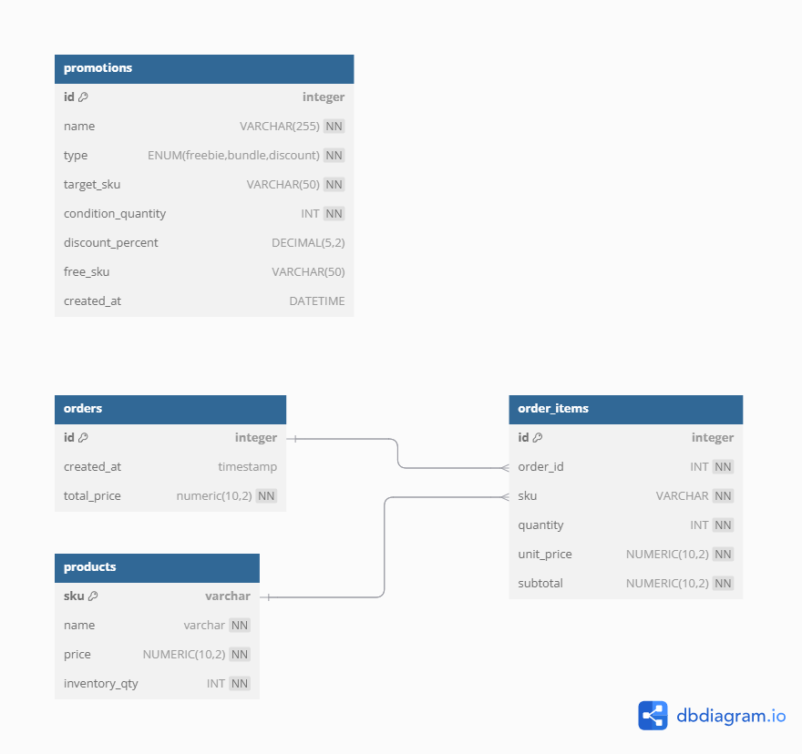

# transaction-service

# 🛒 E-Commerce Checkout System Backend

A backend checkout system for e-commerce applications built with Golang, MySQL, and Clean Architecture principles. The system supports dynamic promotions, inventory management, and transactional checkout processes.

## 🚀 Features

- **Clean Architecture**: Organized with handler, usecase, and repository layers
- **MySQL Database**: Reliable data persistence with GORM ORM
- **Transactional Checkout**: Ensures data consistency during checkout operations
- **Dynamic Promotions**: Flexible promotion system stored in database
- **Multiple Promotion Types**:
  - 🎁 **Freebie**: Buy product A, get product B for free
  - 📦 **Bundle**: Buy 3 items, pay for only 2
  - 💰 **Discount**: Percentage discount when purchasing more than N items
- **Inventory Management**: Automatic stock reduction after successful checkout

## 🧱 Tech Stack

- **Language**: Go 1.22+
- **Database**: MySQL 8.0+
- **ORM**: GORM
- **Architecture**: Clean Architecture Pattern
- **HTTP Framework**: Gorilla Mux

## 📁 Project Structure

```
transaction-service/
|-cmd
|-commons
|-config
|-database
|-internal
|  |-app
|  |-controller
|  |  |-http
|  |  |  |-v1
|  |  |  |  |-checkout
|  |  |-response
|  |-entity
|  |-repository
|  |-usecase
|  |  |-checkout
|-logs
|-pkg
|  |-httpserver
|  |-logger
|  |-mysql
|── docker-compose.yml
├── Dockerfile
├── go.mod
├── go.sum
└── README.md
```

## 🗄️ Database Schema

This database schema is designed for a checkout backend system that supports dynamic promotions and inventory management. It consists of four main tables:

### ERD



### Products Table

```sql
CREATE TABLE IF NOT EXISTS products (
    sku VARCHAR(50) PRIMARY KEY,
    name VARCHAR(255) NOT NULL,
    price DECIMAL(10,2) NOT NULL,
    inventory_qty INT NOT NULL
);
```

### Promotions Table

```sql
CREATE TABLE IF NOT EXISTS promotions (
    id INT AUTO_INCREMENT PRIMARY KEY,
    name VARCHAR(255) NOT NULL,
    type ENUM('freebie', 'bundle', 'discount') NOT NULL,
    target_sku VARCHAR(50) NOT NULL,
    condition_quantity INT NOT NULL,
    discount_percent DECIMAL(5,2),
    free_sku VARCHAR(50),
    created_at DATETIME DEFAULT CURRENT_TIMESTAMP
);
```

Description:
This table allows defining dynamic promotions such as:

- Buy 3 pay for 2
- Buy X, get Y for free
- Buy N and get percentage discounts

### Orders Table

```sql

CREATE TABLE IF NOT EXISTS orders (
    id BIGINT AUTO_INCREMENT PRIMARY KEY,
    created_at DATETIME DEFAULT CURRENT_TIMESTAMP,
    total_price DECIMAL(10,2) NOT NULL
);

CREATE TABLE IF NOT EXISTS order_items (
    id BIGINT AUTO_INCREMENT PRIMARY KEY,
    order_id BIGINT NOT NULL,
    sku VARCHAR(50) NOT NULL,
    quantity INT NOT NULL,
    unit_price DECIMAL(10,2) NOT NULL,
    subtotal DECIMAL(10,2) NOT NULL,
    FOREIGN KEY (order_id) REFERENCES orders(id),
    FOREIGN KEY (sku) REFERENCES products(sku)
);
```

### Goals:

Normalized: Efficient storage, easy expansion
Promotion-Driven: Flexible rules stored in DB
Clean Relationships: Referential integrity maintained

## 🔧 Installation & Setup

### Prerequisites

- Go 1.22 or higher
- MySQL 8.0 or higher
- Git

### 1. Clone the Repository

```bash
git clone https://github.com/kresnard/transaction-service.git
cd transaction-service
```

### 2. Install Dependencies

```bash
go mod
```

### 3. Environment Configuration

- Create a `config.yml` file in the config directory, copy and paste from `config.yml.example`

### 4. Database Setup

- Adjust your mysql
- create your db
- migrate / create table and seed data from dir database/transaction_service.sql

### 5. Start the Server

```bash
go run cmd/main.go
```

The server will start on `http://localhost:8080`

## Dockerfile setup

- Run this command

```
docker build -t trx-service .
```

## 📡 API Endpoints

### Checkout

#### Discount

```http
POST /v1/checkout/order
Content-Type: application/json

{
    "items": [
        "A304SD", "A304SD", "A304SD"
    ]
}
```

**Response:**

```json
{
  "status": true,
  "status_code": "201",
  "message": "success create checkout",
  "data": {
    "id": 26,
    "total_price": 295.65,
    "items": [
      {
        "id": 47,
        "order_id": 26,
        "sku": "A304SD",
        "quantity": 3,
        "unit_price": 109.5,
        "subtotal": 328.5
      }
    ]
  }
}
```

#### Bundle

```http
POST /v1/checkout/order
Content-Type: application/json

{
    "items": [
        "120P90", "120P90", "120P90"
    ]
}
```

**Response:**

```json
{
  "status": true,
  "status_code": "201",
  "message": "success create checkout",
  "data": {
    "id": 27,
    "total_price": 99.98,
    "items": [
      {
        "id": 48,
        "order_id": 27,
        "sku": "120P90",
        "quantity": 3,
        "unit_price": 49.99,
        "subtotal": 149.97
      }
    ]
  }
}
```

#### Freebies

```http
POST /v1/checkout/order
Content-Type: application/json

{
    "items": [
        "43N23P"
    ]
}
```

**Response:**

```json
{
  "status": true,
  "status_code": "201",
  "message": "success create checkout",
  "data": {
    "id": 28,
    "total_price": 5399.99,
    "items": [
      {
        "id": 49,
        "order_id": 28,
        "sku": "43N23P",
        "quantity": 1,
        "unit_price": 5399.99,
        "subtotal": 5399.99
      },
      {
        "id": 50,
        "order_id": 28,
        "sku": "234234",
        "quantity": 1,
        "unit_price": 0,
        "subtotal": 0
      }
    ]
  }
}
```

## Performance & Monitoring

- **Database Connection Pooling**: Configured for optimal performance
- **Transactions**: All checkout operations are wrapped in database transactions
- **Logging**: Structured logging with different levels (DEBUG, INFO, WARN, ERROR)

## Security Considerations

- SQL injection prevention through GORM
- Transaction rollback on failures
